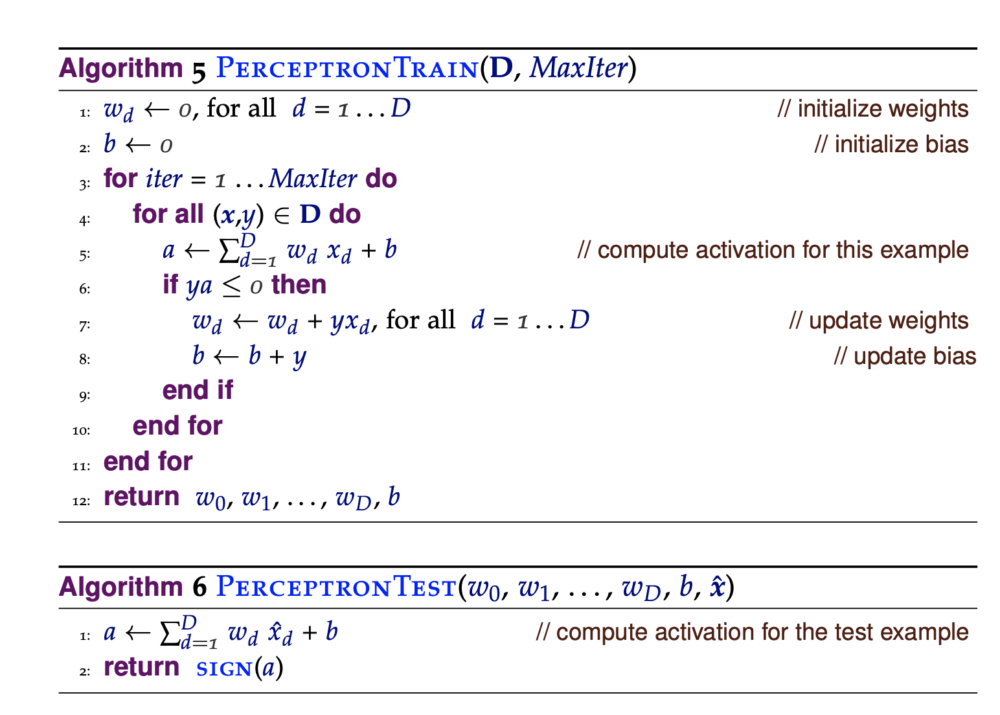
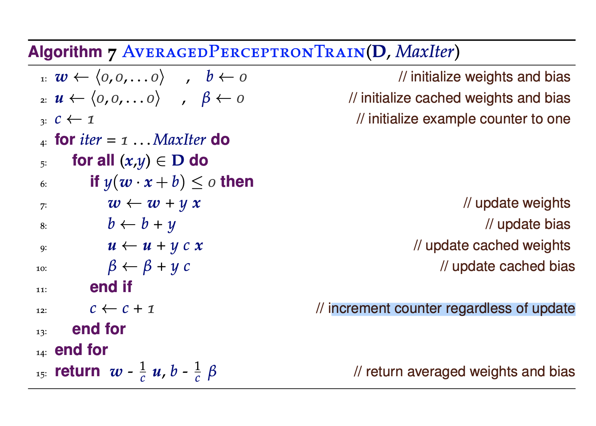

implementing the simple but effective machine learning model, the perceptron, and applying it to a binary text classification task (i.e., spam detection).

per_learn.py will learn a perceptron model from labeled data using the standard training algorithm.
avg_per_learn.py will learn a perceptron model from labeled data using the averaged perceptron training algorithm.
per_classify.py will use a stored perceptron model to classify new data. per_learn.py and avg_per_learn.py will be invoked in the following way:
>python3 per_learn.py /path/to/input
And
>python3 avg_per_learn.py /path/to/input

per_learn.py and avg_per_learn.py will learn a perceptron model from the training data, and write the model parameters to a file called per_model.txt in the current working directory

#### No of Training Iterations
Here we are no longer estimating probabilities but rather adjusting weights meaning that we have to iterate over the training data more than once. It is a difficult problem to decide how many times to iterate over the training data.
- Too few iterations mean the weights have not been sufficiently adjusted and we will get poor performance. 
- Too many iterations mean the weights are too specific to the training data (i.e., "overfitting") and we will get poor performance on the test data. Another issue with trying to get perfect performance on the training data is that sometimes it is impossible (i.e., the data is not linearly separable) and we would end up adjusting the weights forever.
- Generally, researchers experiment with different numbers of training iterations, and may stop training early if they see a performance plateau. Because we will be evaluated based on performance on unseen data, the number of training iterations is set to use:
• For per_learn.py: 20.
• For avg_per_learn.py: 30.

#### Order of Training Examples
Another issue when adjusting weights is that the order of training examples matters even for the averaged perceptron. If we have a large batch of examples with the same label (e.g., "ham"), then there will be some initial weight adjustments but then the perceptron will stop learning since all the examples are "ham". If we then move to a large batch of examples with the opposite label (e.g., "spam"), there will again be some initial weight adjustments but then the perceptron will stop learning since all the examples are "spam". To avoid this, we shuffle the order of the training examples for each training iteration.



```
```



```
```

### Performance of standard perceptron on the development data with 100% of the training data
```python
(base) $ python per_learn.py -v train/
Parsing All Email Files...
Iteration 0 : bias = 0
Iteration 1 : bias = 82
Iteration 2 : bias = 83
Iteration 3 : bias = 129
Iteration 4 : bias = 95
Iteration 5 : bias = 101
Iteration 6 : bias = 104
Iteration 7 : bias = 84
Iteration 8 : bias = 76
Iteration 9 : bias = 73
Iteration 10 : bias = 80
Iteration 11 : bias = 90
Iteration 12 : bias = 72
Iteration 13 : bias = 68
Iteration 14 : bias = 74
Iteration 15 : bias = 71
Iteration 16 : bias = 63
Iteration 17 : bias = 58
Iteration 18 : bias = 61
Iteration 19 : bias = 53
Perceptron Model Trained. Parameters loaded into per_model.txt
(base) $ python per_classify.py -v -e -d dev/ std_training_output.txt
actual :
{'spam': 3675, 'ham': 1500}
prediction :
{'spam': 3678, 'ham': 1497}
correctClassification :
{'spam': 3630, 'ham': 1452}
inCorrectClassification :
{'spam': 45, 'ham': 48}
Discrepancies found in : per_discrepancies.txt
****************Evaluation****************
precision :
{'spam': 0.9869, 'ham': 0.9699}
recall :
{'spam': 0.9878, 'ham': 0.968}
f1_score :
{'spam': 0.9873, 'ham': 0.9689}
weighted_avg :  0.982
(base) $ 
```

### Performance of averaged perceptron on the development data with 100% of the training data
```python
(base) $ python avg_per_learn.py -v train/
Parsing All Email Files...
Iteration 0 : bias = 0 avgBias = 0
Iteration 1 : bias = 61 avgBias = -138901
Iteration 2 : bias = 78 avgBias = 228344
Iteration 3 : bias = 49 avgBias = -846438
Iteration 4 : bias = 40 avgBias = -1467336
Iteration 5 : bias = 73 avgBias = 953648
Iteration 6 : bias = 110 avgBias = 4376358
Iteration 7 : bias = 87 avgBias = 1995704
Iteration 8 : bias = 71 avgBias = 75279
Iteration 9 : bias = 67 avgBias = -509232
Iteration 10 : bias = 51 avgBias = -3130182
Iteration 11 : bias = 46 avgBias = -4116105
Iteration 12 : bias = 64 avgBias = -561885
Iteration 13 : bias = 98 avgBias = 6760986
Iteration 14 : bias = 83 avgBias = 3343003
Iteration 15 : bias = 78 avgBias = 2052901
Iteration 16 : bias = 66 avgBias = -1042658
Iteration 17 : bias = 61 avgBias = -2453282
Iteration 18 : bias = 61 avgBias = -2450533
Iteration 19 : bias = 55 avgBias = -4358605
Iteration 20 : bias = 55 avgBias = -4344998
Iteration 21 : bias = 49 avgBias = -6425938
Iteration 22 : bias = 57 avgBias = -3541055
Iteration 23 : bias = 54 avgBias = -4695138
Iteration 24 : bias = 55 avgBias = -4319474
Iteration 25 : bias = 57 avgBias = -3499523
Iteration 26 : bias = 60 avgBias = -2256386
Iteration 27 : bias = 57 avgBias = -3555290
Iteration 28 : bias = 63 avgBias = -720586
Iteration 29 : bias = 76 avgBias = 5529026
Avg Perceptron Model Trained. Parameters loaded into per_model.txt

(base) $ python per_classify.py -v -e -d dev/ avg_training_output.txt
actual :
{'spam': 3675, 'ham': 1500}
prediction :
{'spam': 3673, 'ham': 1502}
correctClassification :
{'spam': 3618, 'ham': 1445}
inCorrectClassification :
{'spam': 57, 'ham': 55}
Discrepancies found in : per_discrepancies.txt
****************Evaluation****************
precision :
{'spam': 0.985, 'ham': 0.9621}
recall :
{'spam': 0.9845, 'ham': 0.9633}
f1_score :
{'spam': 0.9847, 'ham': 0.9627}
weighted_avg :  0.9783
(base) $ 
```


### Performance of standard perceptron on the development data with 10% of the training data
```python
(base) $ python per_learn.py -v train/ -p 10
Parsing 10% of Email Files
total_no_of_emails :  17029
no_of_spam_emails :  7496
no_of_ham_emails :  9533

part_total_no_of_emails :  1702
part_no_of_spam_emails :  851
part_no_of_ham_emails :  851
Iteration 0 : bias = 0
Iteration 1 : bias = 10
Iteration 2 : bias = 4
Iteration 3 : bias = 13
Iteration 4 : bias = 19
Iteration 5 : bias = 16
Iteration 6 : bias = 16
Iteration 7 : bias = 13
Iteration 8 : bias = 20
Iteration 9 : bias = 23
Iteration 10 : bias = 22
Iteration 11 : bias = 20
Iteration 12 : bias = 21
Iteration 13 : bias = 20
Iteration 14 : bias = 20
Iteration 15 : bias = 21
Iteration 16 : bias = 21
Iteration 17 : bias = 21
Iteration 18 : bias = 21
Iteration 19 : bias = 20
Perceptron Model Trained. Parameters loaded into per_model.txt
(base) $ python per_classify.py -v -e -d dev/ 10_std_training_output.txt
actual :
{'spam': 3675, 'ham': 1500}
prediction :
{'spam': 3490, 'ham': 1685}
correctClassification :
{'spam': 3322, 'ham': 1332}
inCorrectClassification :
{'spam': 353, 'ham': 168}
Discrepancies found in : per_discrepancies.txt
****************Evaluation****************
precision :
{'spam': 0.9519, 'ham': 0.7905}
recall :
{'spam': 0.9039, 'ham': 0.888}
f1_score :
{'spam': 0.9273, 'ham': 0.8364}
weighted_avg :  0.901
(base) $ 
```

### Performance of averaged perceptron on the development data with 10% of the training data
```python
(base) $ python avg_per_learn.py -v train/ -p 10
Parsing 10% of Email Files
total_no_of_emails :  17029
no_of_spam_emails :  7496
no_of_ham_emails :  9533

part_total_no_of_emails :  1702
part_no_of_spam_emails :  851
part_no_of_ham_emails :  851
Iteration 0 : bias = 0 avgBias = 0
Iteration 1 : bias = 16 avgBias = 26985
Iteration 2 : bias = 22 avgBias = 47798
Iteration 3 : bias = 28 avgBias = 73262
Iteration 4 : bias = 20 avgBias = 32427
Iteration 5 : bias = 31 avgBias = 120160
Iteration 6 : bias = 28 avgBias = 94680
Iteration 7 : bias = 19 avgBias = -1135
Iteration 8 : bias = 17 avgBias = -29479
Iteration 9 : bias = 14 avgBias = -73609
Iteration 10 : bias = 21 avgBias = 41873
Iteration 11 : bias = 18 avgBias = -16396
Iteration 12 : bias = 17 avgBias = -36785
Iteration 13 : bias = 16 avgBias = -57973
Iteration 14 : bias = 15 avgBias = -82457
Iteration 15 : bias = 18 avgBias = -8166
Iteration 16 : bias = 18 avgBias = -7671
Iteration 17 : bias = 18 avgBias = -6110
Iteration 18 : bias = 19 avgBias = 23630
Iteration 19 : bias = 19 avgBias = 25255
Iteration 20 : bias = 20 avgBias = 58293
Iteration 21 : bias = 20 avgBias = 57882
Iteration 22 : bias = 22 avgBias = 131317
Iteration 23 : bias = 21 avgBias = 92508
Iteration 24 : bias = 20 avgBias = 51151
Iteration 25 : bias = 23 avgBias = 177168
Iteration 26 : bias = 23 avgBias = 178423
Iteration 27 : bias = 23 avgBias = 178423
Iteration 28 : bias = 23 avgBias = 178423
Iteration 29 : bias = 23 avgBias = 178423
Avg Perceptron Model Trained. Parameters loaded into per_model.txt
(base) $ python per_classify.py -v -e -d dev/ 10_avg_training_output.txt
actual :
{'spam': 3675, 'ham': 1500}
prediction :
{'spam': 3573, 'ham': 1602}
correctClassification :
{'spam': 3404, 'ham': 1331}
inCorrectClassification :
{'spam': 271, 'ham': 169}
Discrepancies found in : per_discrepancies.txt
****************Evaluation****************
precision :
{'spam': 0.9527, 'ham': 0.8308}
recall :
{'spam': 0.9263, 'ham': 0.8873}
f1_score :
{'spam': 0.9393, 'ham': 0.8581}
weighted_avg :  0.9158
(base) $ 
```